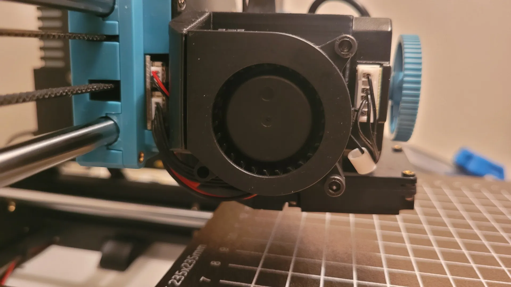

## Part Cooling

Improve mediocre part cooling and get better quality prints with better overhangs.

When upgrading fans it is recommended to upgrade to a more durable dual ball bearing or hydraulic fan from a known brand.

I typically use GDSTime fans but a cheaper but still good option is Winsinn.

!!! tip "Buy links"

    - Winsinn 5015 24V: [AliExpress](https://www.aliexpress.com/item/1005003878734109.html?aff_fcid=eda4c6ae5bfe46c7a4aafb8ef3138d7a-1683990854662-02316-_DE0fgiN&tt=CPS_NORMAL&aff_fsk=_DE0fgiN&aff_platform=shareComponent-detail&sk=_DE0fgiN&aff_trace_key=eda4c6ae5bfe46c7a4aafb8ef3138d7a-1683990854662-02316-_DE0fgiN&terminal_id=3f8c776975fd455ba956809c02d71a91&afSmartRedirect=y)

All of the mentioned fans do not have the JST 1.25 connector used by Sovol. You will need to cut the wires and connect the compatible connector. [More information...](/Parts/electronic-parts/#wires-with-connectors)

## CFD Optimized v2.0 5015 Fan Duct

Fan duct for 5015 fan optimized with Computational Fluid Dynamics (CFD) Version 2.0

[@taeky on Cults3D](https://cults3d.com/en/3d-model/tool/sovol-sv06-fan-duct-5015-cfd-optimized-version-2-0)

## 5015 Duct

[@SavageLau on Printables](https://www.printables.com/model/416412-sv06-5015-fan-duct)

<iframe width="560" height="315" src="https://www.youtube-nocookie.com/embed/2nAV7mS2qhA" title="YouTube video player" frameborder="0" allow="accelerometer; autoplay; clipboard-write; encrypted-media; gyroscope; picture-in-picture; web-share" allowfullscreen></iframe>

## 5015 Fan

<iframe width="560" height="315" src="https://www.youtube-nocookie.com/embed/hw39j5DV56M" title="Added a 5015 Blower Fan to my Sovol SV06" frameborder="0" allow="accelerometer; autoplay; clipboard-write; encrypted-media; gyroscope; picture-in-picture; web-share" allowfullscreen></iframe>

## Heat Break

Improve cooling of the heat break to prevent heat creep and heat break clogs.

## Adapter for 4020 fan

Replace the stock 4010 blower fan with a 4020 blower fan.

[@Spb2005 on Printables](https://www.printables.com/model/451696-sovol-sv06-4020-cooling-fan-heatcreep-fix)

## Adapter for 5015 fan

Replace the stock 4010 blower fan with a 5015 blower fan.

[@Spb2005 on Printables](https://www.printables.com/en/model/557198-sovol-sv06-5015-fan-mount-heatcreep-fix)

[@Mensa on Printables](https://www.printables.com/model/490744-5015-hotend-fan-mount-for-sovol-sv06-remixed-from-)

[@LeanderPerezB_802715 on Printables](https://www.printables.com/en/model/472199-sovol-sv06-plus-extruder-colling-fan-5015)

## TH3D 5015 Upgrade Kit

Kit includes an ABS printed 5015 fan mount along with the 5015 fan and all the nuts, bolts, and washers to install the kit on your SV06. Available from [TH3D](https://www.th3dstudio.com/product/sovol-sv06-5015-layer-fan-upgrade-kit/?share=blakadder&campaign=sovol).
